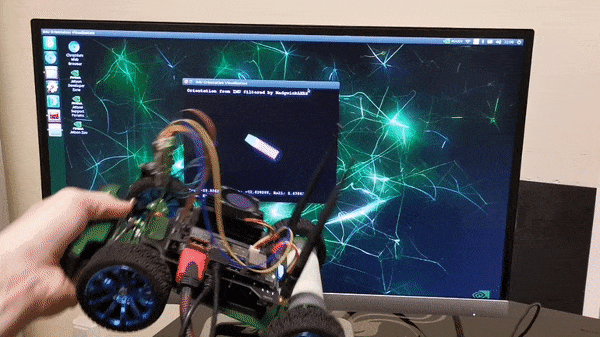
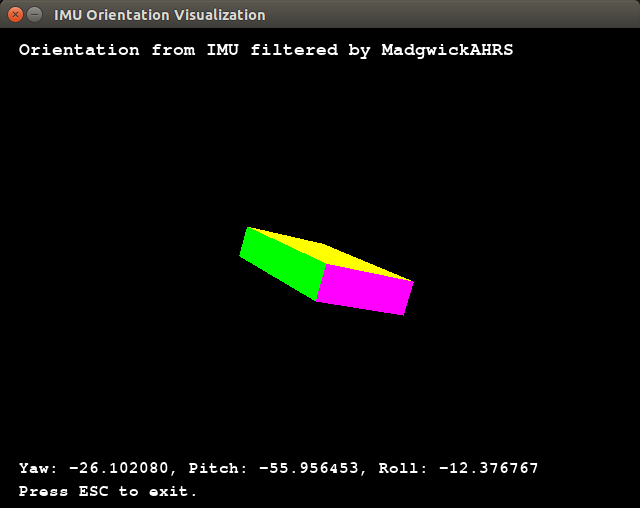

# IMU Visualizer

## Requirements

This module requires a ICM20948 IMU connected on bus 0.

## Setup

Install required packages (both Debian and Python) by running
the included setup script:

```bash
./setup.sh
```

Source the virtual environment:

```bash
source .venv/bin/activate
```

## Run

Run using Python 3 in the sourced virtual environment:

```bash
python3 main.py
```

The module is able to accurately capture the orientation of Jetracer and visualize it in 3D:



## Screenshot



## Tweak

Adjust the variable `sensor_mounting_orientation` in `main.py` according to the orientation of your mounted sensor.
